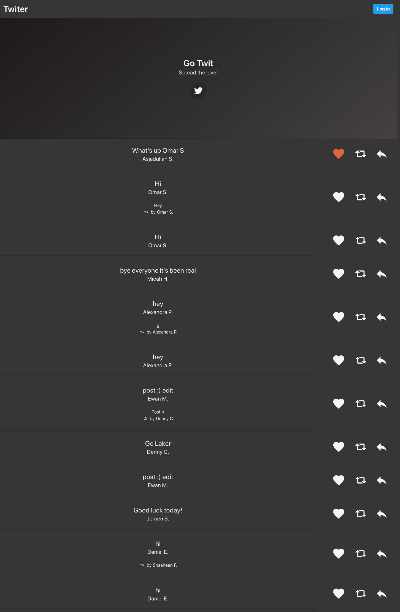
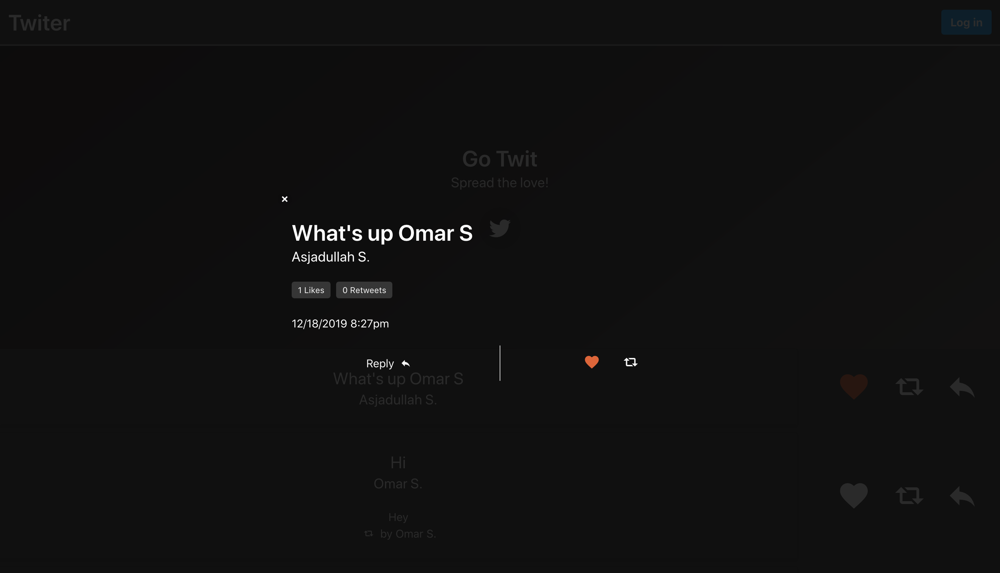
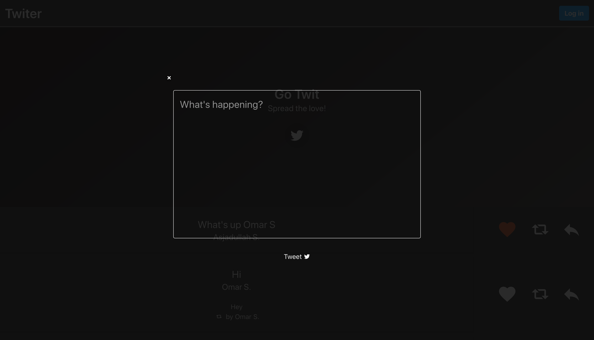

# twiter
A Twiter clone made for a class assignment

## Screenshots
### Landing Page

### Tweet Detailed View

### New Tweet View

## API
### INDEX Endpoint
- Purpose: Retrieves a list of the most recent Tweets as a JSON array
- Endpoint: GET  https://comp426fa19.cs.unc.edu/a09/tweets
- Request Params:
  - skip (integer) - Optional. If omitted, defaults to 0. Used for pagination. Specifies the number of Tweets to skip before seleting Tweets to retrieve.
  - limit (integer) - Optional. If omitted, defaults to 50. Used for pagination. Specifies the number of Tweets to retrieve. Must be in the range [1, 75].
  - sort (json) - Optional. Specifies the order of the Tweets to retrieve. Must be a Tweet field name followed by "ASC" or "DESC" to denote ascending or descending, respectively. If omitted, defaults to [{createdAt: 'DESC'}] which selects newest Tweets first.
  - where (json) - Optional. Specifies a filter to apply to the Tweets before retrievial. If omitted, defaults to {type: ['tweet', 'retweet']}, which selects only Tweets with type "tweet" and "retweet" (not "reply" Tweets). 
- Response: Responds with an array in JSON format containing the selected Tweets.

### CREATE Endpoint
- Purpose: Creates a new tweet in the database
- Endpoint: POST  https://comp426fa19.cs.unc.edu/a09/tweets
- Request Params:
  - body (string) - Required. The body text of the Tweet. Can be up to 280 characters in length.
  - type (string) - Optional. Defaults to "tweet". Specifies whether the Tweet is a regular Tweet, a reply to another Tweet, or a retweet of another Tweet. Must be one of the following values: ["tweet", "retweet", "reply"].
  - parent (number) - Optional, but required if type is set to "retweet" or "reply". Specifies the id of the associated Tweet.
- Response: Upon successful creation, this route responds with the created Tweet's field data in JSON format.

### READ Endpoint
- Purpose: Gets details about a specific Tweet
- Endpoint: GET  https://comp426fa19.cs.unc.edu/a09/tweets/:id Note: Replace ":id" in the above route with the id of the Tweet to retrieve
- Request Params: This route does not accept request params, but the ID of the Tweet that should be retrieved must be specified in the URL.
- Response: This route responds with details about the Tweet's field data in JSON format.

### UPDATE Endpoint
- Purpose: Updates a specific tweet
- Endpoint: PUT  https://comp426fa19.cs.unc.edu/a09/tweets/:id Note: Replace ":id" in the above route with the id of the Tweet to update
- Request Params:
  - body (string) - Required. The new body text of the Tweet. Can be up to 280 characters in length.
- Response: Upon successful update, this route responds with the updated
	Tweet's new data in JSON format.

### DESTROY Endpoint
- Purpose: Permanently deletes a specific Tweet
- Endpoint: DELETE  https://comp426fa19.cs.unc.edu/a09/tweets/:id Note: Replace ":id" in the above route with the id of the Tweet to destroy
- Request Params: This route does not accept request params, but the id of the Tweet that should be deleted must be specified in the URL.
- Response: Upon successful deletion, this route responds with an empty response body.

### LIKE Endpoint
- Purpose: Likes a specific Tweet
- Endpoint: PUT  https://comp426fa19.cs.unc.edu/a09/tweets/:id/like Note: Replace ":id" in the above route with the id of the Tweet to like
- Request Params: This route does not accept request params, but the ID of the Tweet that should be liked must be specified in the URL.
- Response: Upon successful unlike, this route responds with an empty response body.

### UNLIKE Endpoint
- Purpose: Unlikes a specific Tweet
- Endpoint: PUT  https://comp426fa19.cs.unc.edu/a09/tweets/:id/unlike Note: Replace ":id" in the above route with the id of the Tweet to unlike
- Request Params: This route does not accept request params, but the ID of the Tweet that should be unliked must be specified in the URL.
- Response: Upon successful unlike, this route responds with an empty response body.

## Tweet Object
|  name      |   type    |   example   |                description
-------------|-----------|-------------|---------------------------------------------
|    id      |  number   |     498     | The unique identification number assigned to the Tweet by the server database
|   type     |  string   |  "retweet"  | Specifies whether the Tweet is a regular tweet ("tweet"), a reply to another Tweet ("reply"), or a retweet of another Tweet ("retweet")  Must be one of the following values: ["tweet", "retweet", "reply"]
|   body     |  string   | "This is what the user said" | The body text of the Tweet  |
   author    |  string   | "Aaron S."  | The first name and last initial of the user who posted the Tweet, as a string
  parentId   |  number   |     263     | If this Tweet is a reply or a retweet, this is the id of the referenced Tweet
|  parent    |  Tweet object |             | If this Tweet is a reply or a retweet and the referenced Tweet is available, then this is the referenced Tweet's data
|  isMine    |  boolean  |    false    | True if the Tweet was created by the current, logged in user
|  isLiked   |  boolean  |     true    | True if the Tweet is liked by the current, logged in user
retweetCount |  number   |      0      | The number of retweets for this Tweet
| replyCount |  number   |      1      | The number of replies for this Tweet
| likeCount  |  number   |      1      | The number of likes for this Tweet
| someLikes  | array of strings | ["Erin S."] | A non-exhaustive list of names of users who have liked this tweet
| replies    | array of Tweet objects |             | If available, this is an array of reply Tweets that were posted in response to this Tweet
| createdAt  | timestamp |             | The date and time at which the Tweet was posted
| updatedAt  | timestamp |             | The date and time at which the Tweet was last updated